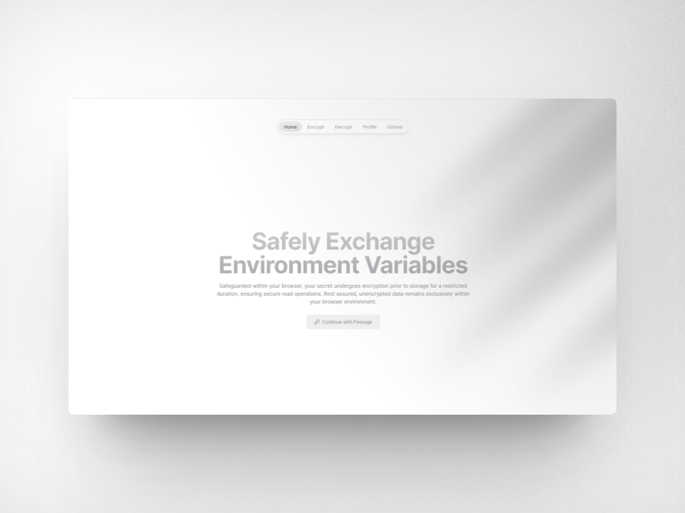

<a href="https://1hash.vercel.app">
  
  <h1 align="center">🔑 1hash</h1>
</a>

  An open-source and safe platform for sharing environment variables and secrets 

  
  

  <a href="#introduction"><strong>Introduction</strong></a> ·
  <a href="#deploy-your-own"><strong>Deploy Your Own</strong></a> ·
  <a href="#setting-up-locally"><strong>Setting Up Locally</strong></a> ·
  <a href="#tech-stack"><strong>Tech Stack</strong></a> ·
  <a href="#contributing"><strong>Contributing</strong></a> ·
  <a href="#license"><strong>License</strong></a>

 

## Introduction

[1hash](https://1hash.vercel.app) is a safe platform for sharing environment variables and secrets

Here's a quick demo:

https://github.com/elousia/1hash/assets/103849745/6a5518b3-64df-4909-aee0-de7ba95555c6

 

## Deploy Your Own

You can deploy your own version of 1hash to Vercel with one click:

[](https://vercel.com/new/clone?repository-url=https%3A%2F%2Fgithub.com%2Felousia%2F1hash&env=UPSTASH_REDIS_REST_URL,UPSTASH_REDIS_REST_TOKEN,PASSAGE_APP_ID,PASSAGE_API_KEY&envDescription=API%20Keys%20needed%20for%20a%20successful%20deployment.%20Override%20vercel%20install%20command%20with%20%60npm%20install%20--legacy-peer-deps%60&demo-title=1hash&demo-description=A%20secure%20way%20of%20sharing%20environment%20variables&demo-url=https%3A%2F%2F1hash.vercel.app&demo-image=https%3A%2F%2F1hash.vercel.app%2Flanding.png)

## Setting Up Locally

To set up 1hash locally, follow these steps:

- Create a `.env` file that looks like the `env.sample` file
- Create a new Redis database on [Upstash](https://console.upstash.com/)
- Copy these credentials into `.env` file
  - `UPSTASH_REDIS_REST_URL`
  - `UPSTASH_REDIS_REST_TOKEN`
- Now you need configure Passage for authentication. Log in to [Passage](https://console.passage.id/register)
- Create an application in the Passage Console with the following settings:
  - Authentication origin: `http://localhost:3000` (change this to your production URL if you decide to deploy)
  - Redirect URL: `/encrypt`
- Once the application has been created, copy the Application ID from the console into a `.env` file
- Run `npm install` or `npm install --legacy-peer-deps` in your terminal to install dependencies
- Run `npm run dev` start the app
- Open [http://localhost:3000](http://localhost:3000) to view the app 🍰

## Tech Stack

1hash is built on the following stack:

- [Next.js](https://nextjs.org/) – framework
- [Upstash](https://console.upstash.com) - data store
- [Passage](https://passage.id/) – authentication provider
- [Vercel](https://vercel.com) – depoloyments
- [TailwindCSS](https://tailwindcss.com/) – styles

## Contributing

Here's how you can contribute:

- [Open an issue](https://github.com/elousia/1hash/issues) if you believe you've encountered a bug.
- Make a [pull request](https://github.com/elousia1hash/pull) to add new features/make quality-of-life improvements/fix bugs.

## Authors

- Elousia ([@elousia](https://github.com/elousia)) 
- Yeshua ([@yeshua](https://github.com/lucky-chap)) 

## License

Licensed under the [MIT license](/LICENSE).
